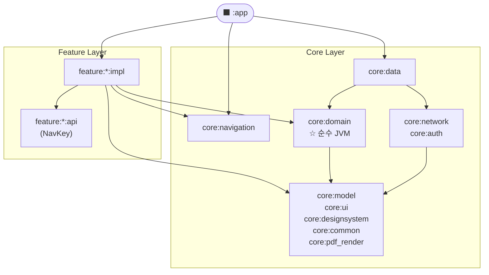

# 농글농글
농가 특화된 이력서를 작성하고 PDF로 저장하는 Android 앱

## 주요 기능

- **이력서 작성** — 경력, 자격증, 키워드를 단계별로 입력
- **PDF 저장** — 화면을 그대로 PDF로 변환하여 기기 다운로드 폴더에 저장
- **이력서 목록 관리** — 저장된 이력서 조회 및 삭제

### 이력서 작성 기능

https://github.com/user-attachments/assets/09a9a153-a1fb-45e2-999f-addc9d7da443

### 이력서 열람 및 PDF 저장 기능
이력서 PDF 변환

https://github.com/user-attachments/assets/3ee38c37-5d22-44b1-a728-8bcda465bd38

변환된 PDF


## 아키텍처 구조도

클린 아키텍처와 멀티모듈 구조를 기반으로 설계했습니다.  
각 레이어는 단방향 의존성을 가지며, 피처 모듈은 `api / impl` 두 모듈로 분리하여 순환 의존성을 방지합니다.

```
┌─────────────────────────────────────────────────────────────┐
│                           :app                              │
│        MainActivity · NonggleApp · EntryProvider 조합        │
└────────────────────┬──────────────────┬─────────────────────┘
                     │                  │
       ┌─────────────▼──────┐   ┌───────▼───────────────────┐
       │  feature:*:impl    │   │      core:navigation       │
       │  Screen · ViewModel│   │  NavigationState · Navigator│
       │  Contract · Entry  │   └───────────────────────────┘
       │  Provider          │
       └─────────────┬──────┘
                     │ (api만 참조)
       ┌─────────────▼──────┐
       │   feature:*:api    │
       │  @Serializable     │
       │  NavKey            │
       └─────────────┬──────┘
                     │
┌────────────────────▼────────────────────────────────────────┐
│                       Core Layer                            │
│                                                             │
│  core:domain          core:data           core:model        │
│  (순수 JVM)     ←──   (Ktor · 저장소)      (엔티티)          │
│  UseCase              Repository Impl                       │
│  Repository I/F                                             │
│                                                             │
│  core:network  core:auth  core:designsystem  core:ui        │
│  core:common   core:pdf_render                              │
└─────────────────────────────────────────────────────────────┘
```

**의존성 방향 원칙**
- 상위 레이어 → 하위 레이어 단방향
- `feature:impl` 간 직접 의존 없음 (`Navigator` 확장함수로 연결)
- `core:domain` 은 순수 Kotlin JVM 모듈 (Android 의존성 0)
- `feature:impl` → 자신의 `feature:api` 만 참조

<br>

## 의존성 그래프


<br>

## 테크 스택

### Android

| 분류 | 기술 | 비고 |
|---|---|---|
| 언어 | Kotlin | 2.2.10 |
| UI | Jetpack Compose + Material3 | BOM 2025.08.00 |
| 네비게이션 | Navigation3 (androidx) | 1.1.0-alpha01 |
| DI | Dagger Hilt + KSP | 2.57.2 |
| 비동기 | Kotlin Coroutines + Flow | 1.10.2 |
| 네트워크 | Ktor Client (OkHttp 엔진) | 3.4.0 |
| 이미지 | Coil3 | 3.3.0 |
| 직렬화 | Kotlinx Serialization | 1.6.3 |
| 보안 | Google Tink | 1.20.0 |
| 인증 | Kakao SDK | 2.23.2 |
| 애니메이션 | Lottie | 6.7.1 |
| PDF 생성 | android.graphics.pdf.PdfDocument | 네이티브, 외부 라이브러리 미사용 |
| 정적 분석 | Detekt | 1.23.8 |
| 빌드 | AGP + Convention Plugins | 8.13.0 |
| 테스트 | JUnit4 · MockK · Espresso | — |

### 최소 요구 사양

| 항목 | 값 |
|---|---|
| Min SDK | API 26 (Android 8.0) |
| Target SDK | API 36 |
| 언어 | Kotlin Only |

<br>

## 모듈 구조

```
NonggleResume
├── app/                         # 진입점, EntryProvider 조합, 인증 흐름
│
├── feature/
│   ├── home/
│   │   ├── api/                 # HomeNavKey
│   │   └── impl/                # HomeScreen · HomeViewModel
│   ├── resume/
│   │   ├── api/                 # ResumeNavKey
│   │   └── impl/                # 단계별 작성 화면 (step1~3, complete)
│   ├── resume_view/
│   │   ├── api/                 # ResumeViewNavKey(resumeId)
│   │   └── impl/                # 이력서 미리보기 + PDF 변환
│   ├── download/
│   │   ├── api/                 # DownLoadNavKey
│   │   └── impl/                # 저장된 이력서 목록
│   ├── mypage/
│   │   ├── api/                 # MyPageNavKey
│   │   └── impl/                # 사용자 설정
│   └── login/
│       ├── api/                 # LoginNavKey
│       └── impl/                # 카카오 OAuth
│
├── core/
│   ├── domain/                  # UseCase · Repository 인터페이스 (순수 JVM)
│   ├── data/                    # Repository 구현체 · Ktor · 로컬 저장소
│   ├── model/                   # 도메인 엔티티
│   ├── navigation/              # NavigationState · Navigator
│   ├── network/                 # Ktor 클라이언트 설정
│   ├── auth/                    # Google Tink 암호화 · 토큰 관리
│   ├── designsystem/            # 공통 컴포넌트 · 테마 · 아이콘
│   ├── ui/                      # BaseViewModel (Event / State / Effect)
│   ├── common/                  # AuthEventBus · DownloadFileSaver · 유틸리티
│   └── pdf_render/              # PdfGenerator · PdfRenderMonitor
│
└── build-logic/
    └── convention/              # Custom Gradle Convention Plugin (7종)
```

<br>

## 주요 구현 상세

### PDF 변환 파이프라인

외부 PDF 라이브러리 없이 Android 네이티브 `PdfDocument` 로 구현했습니다.  
Compose 화면을 Bitmap 없이 Canvas에 직접 그려 해상도 손실이 없습니다.

```
① ComposeView 생성 및 윈도우 부착
        ↓
② 레이아웃 완료 대기 (ViewTreeObserver)
        ↓
③ 비동기 이미지 로딩 완료 대기 (PdfRenderMonitor)
        ↓
④ 전체 컨텐츠 높이 측정 → 페이지 분할 계산 (auto-rebalance)
        ↓
⑤ 페이지별 canvas.translate + clipRect + composeView.draw(canvas)
        ↓
⑥ PdfDocument → OutputStream 직렬화
        ↓
⑦ DownloadFileSaver → 기기 다운로드 폴더 저장
        (Android 10+: MediaStore API / Android 9-: 직접 파일 복사)
```

---

<br>

